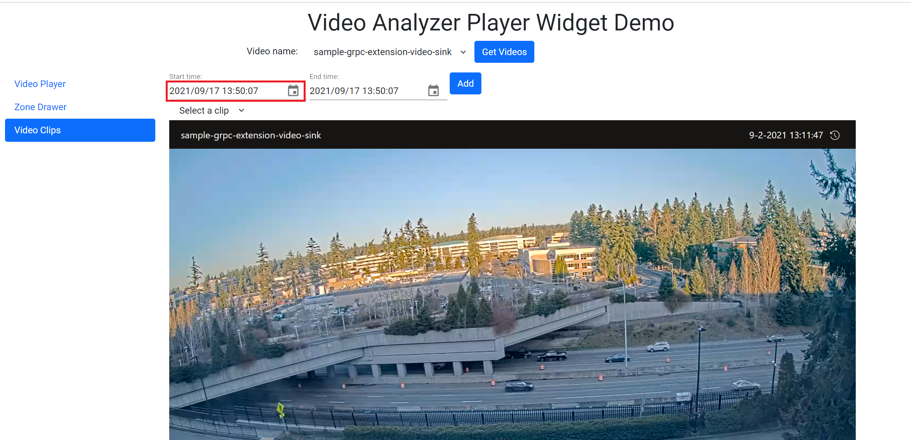
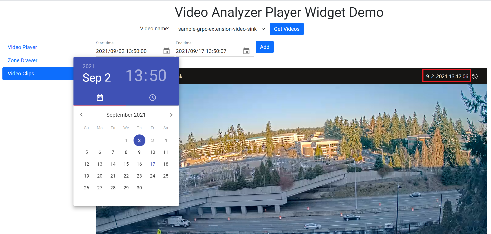
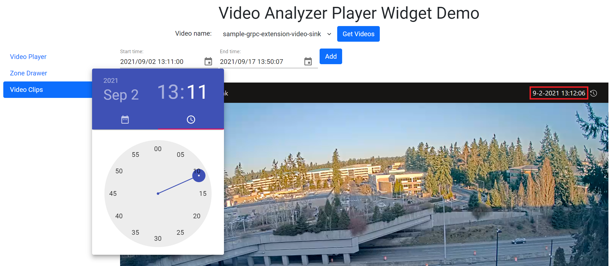
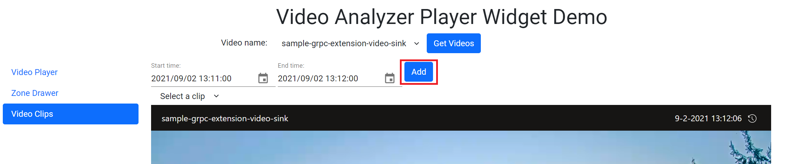
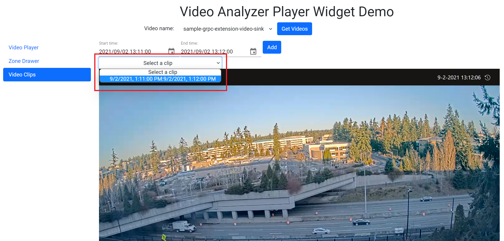

# AVA Video Player

This directory contains a ReactJS app that will enable you to view videos using the AVA widget player.

## Prerequisites
1. npm

## Setup

Update the file named .env in **src** folder and replace the placeholders in it. Provide values for all variables.

```env
REACT_APP_TOKEN=<TOKEN>
REACT_APP_CLIENT_API_ENDOINT_URL=<CLIENT_API_ENDOINT_URL>
```

## Running the sample
1. CD to the src folder 
2. Get the application dependencies by executing the command:
```bash
npm install
``` 
3. Run the application by executing the command:
```bash
npm start
```
Runs the app in the development mode.\
Open [http://localhost:3000](http://localhost:3000) to view it in the browser.

## Creating Video Clips
1. Select the **Video Clips** tab

2. Click on the *Start time* date time picker:


3. Select the date of the video:


4. Select the start time of the video clip:


5. Perform the same steps for the *End time*

6. Once you add set the *Start time* and *End time*, click on the **Add** button:


7. Select the created *Video Clip* from the drop down list:


